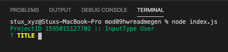

# 05 Node JS: README Generator
     

## Description

Target is creating a command line application that dynamically generates a professional README.md from a user's input using Inquirer NPM package, also using a privided documentation as a guideline as to what content does a quality document should have.

## Snapshot

## Table.Of.Contents

* [Description](#Description)
* [Snapshot](#Snapshot)
* [TableOfContents](#TableOfContents)
* [UserStory](#UserStory)
* [AcceptanceChecklist](#AcceptanceChecklist)
    * [InitialRequirements](#InitialRequirements)
    * [ApplicationRequirements](#ApplicationRequirements)
    * [SubmissionRequierements](#SubmissionRequierements)
* [AppUsage](#AppUsage)
    * [Instalattion](#Instalattion)
    * [Configuration](#Configuration)
    * [Operation](#Operation)
* [Features](#Features)
* [VideoWalkthrough](#VideoWalkthrough)

## UserStory

AS A developer

I WANT a README generator

SO THAT can quickly create a professional README for a new project

## AcceptanceChecklist

### InitialRequirements
GIVEN a command-line application that accepts user input...

WHEN I am prompted for information about my application repository...

THEN a quality, professional README.md is generated with the title of your project and sections entitled Description, Table of Contents, Installation, Usage, License, Contributing, Tests, and Questions.

    - All of sections specified are required to be submitted by the user. Issac

WHEN I enter my project title...

THEN this is displayed as the title of the README.

    - Done. Issac.

WHEN I enter a description, installation instructions, usage information, contribution guidelines, and test instructions...

THEN this information is added to the sections of the README entitled Description, Installation, Usage, Contributing, and Tests.

    - Done. Issac.

WHEN I choose a license for my application from a list of options...

THEN a badge for that license is added near the top of the README and a notice is added to the section of the README entitled License that explains which license the application is covered under.

    - Done. Issac.

WHEN I enter my GitHub username...

THEN this is added to the section of the README entitled Questions, with a link to my GitHub profile.

    - Done. Issac.

WHEN I enter my email address...

THEN this is added to the section of the README entitled Questions, with instructions on how to reach me with additional questions.

    - Done. Issac.

WHEN I click on the links in the Table of Contents...

THEN I am taken to the corresponding section of the README

    - Done. Issac.

### ApplicationRequirements

Meets specified Submission Requieremnts.

    - Requierements are reviewed and checklisted in the following section. Done. Issac.

Functional application.

    - Done. Issac.

GitHub repository with a unique name and a README describing project.

    - GitHub Repo > https://github.com/carlosissac/mod09hwreadmegen

    - Project Readme > https://github.com/carlosissac/mod09hwreadmegen/blob/master/README.md

Generated README includes the following sections: Title, Description, Table of Contents, Installation, Usage, License, Contributing, Tests, Questions.

    - Done. Issac.

 The generated README includes 1 badge that's specific to the repository.

    - Includes 2 badges specific to repository, 1) Last Commit and 2) Code Size. Done. Issac.

### SubmissionRequierements

Because this is a CLI App, there will be no need to deploy it to Heroku. This time, though, you need to include a video showing us that you got the app working with no bugs. You should include a link to the video in your application's README.md file.

    - Link is provided subsequent section. Issac.

Create a .gitignore file and include node_modules/ and .DS_Store/.

    - https://github.com/carlosissac/mod09hwreadmegen/blob/master/.gitignore. Issac.

node_modules is not tracked and uploaded to GitHub.

    - node_modules folder is not being tracked in our repo and listed in .gitignore file. Issac

Repo must include package.json with required dependencies.

    - https://github.com/carlosissac/mod09hwreadmegen/blob/master/package.json. Issac.

Include a video of the typical user flow through your application. This includes views of the prompts and the responses after their selection.

    - Link will be provided in suubsequent section. Issac.

Include any other screenshots you deem necessary to help someone who has never been introduced to your application understand the purpose and function of it. This is how you will communicate to potential employers/other developers in the future what you built and why, and to show how it works.

    - Application Usage section will be provided in this ReadMe. Issac.

Because screenshots (and well-written READMEs) are extremely important in the context of GitHub, this will be part of the grading.

    - All usage details will be provided in this ReadMe file. Issac.

## AppUsage

### Instalattion 

*Step 1.* Clone repo into your localhost.

*Step 2.* Open Terminal and run "npm i --save" in order to install dependencies.

*Step 3.* Write "node index.js"

*Step 4.* Set "select_mode" to either true or false depending on the mode you want to run.

### Configuration 

*Step 1.* Open Index.js file.

*Step 2.* Make sure that the following flag is set to True.

### Operation 

*Step 1.* Go to Terminal and run index.js.

*Step 2.* ProjectID and InputType will be shown.

*Step 3.* Submit input as required and press enter as prompted. When a caption is shown "Press <enter> to launch your preferred editor". Press enter so that VIM editor is shown.

*Step 4.* VIM editor will be shown.

*Step 5.* Press "i" and the "INSERT" caption will be shown below

*Step 6.* Write text content. After you are done press "ESC" key and ":wq!" 

## Features

* *Editor capture.* When some of the README sections require large amounts of texts user is taken to VIM editor for a better text capture.

* *List option.* When prompted for license type we are asked to select from a list of options.

* *Recursive capture.* After static input is captured the user will be propmpted for several items in a recursive manner. By this we mean that the user will be prompted for items until the user decides to move on.

* *Fixed Input Mode.*. This mode was developed in order to do an integration test beween the ReadMe, Writer and Fixed moduled, and also in order to test the markdown document fornat.

* *Jest Unit testing.* ReadMe, Writer and License proto were unit tested using JEST. These tests are coded the the files ending in ".test.js". Unit test results are stored in "coverage/lcov-report/index.html" file, currently not tracked using GitHub.

## VideoWalkthorugh

The following links provide a video walkkthoroughs explaining the development desicions made for this project and a walkthorugh of the usage of the app. Also provided is a slide deck for the explanation video

* Explanation > 

* PowerPoint Deck >

* Walkthorugh > 