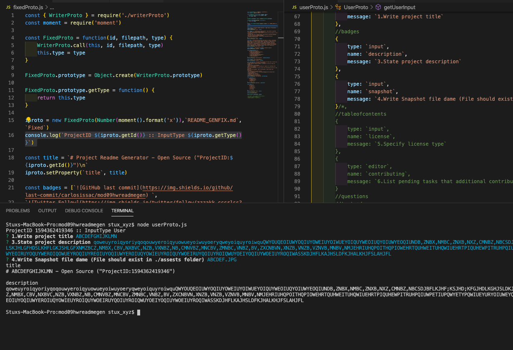
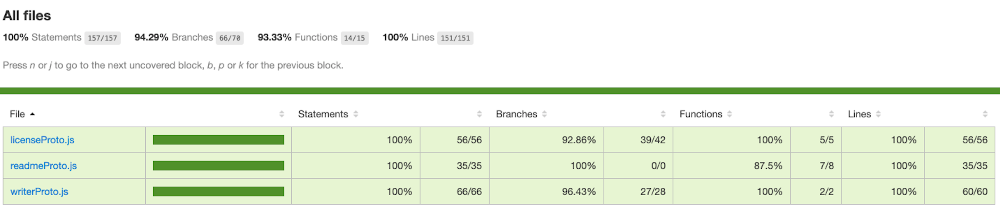

# Project Readme Generator - User Input - Open Source ("ProjectID:1594962146861")
 
## Description
When creating an open source project on GitHub, it is important to have a quality README with information about the app--what is the app for, how to use the app, how to install it, how to report issues, and how to make contributions so that other developers are more likely to use and contribute to the success of the project. A command-line application will allow for quick and easy generation of a project README to get started quickly. This will allow a project creator to spend more time working on finishing the project and less time creating a good README.
## Usage
After installation is done open index.js and set "select_mode = false;" in order to use Fixed Mode. This has predefined inputs and it should be used for integration testing purposes.\nSet "select_mode = true;" in order use User Mode and let the user submit custom input. Both modes can be executed by running "Node index.js" in terminal.

## Table Of Contents
* [Description](#Description)
* [Usage](#Usage)
* [License](#License)
* [Installation](#Installation)
* [Tests](#Tests)
* [Credits](#Credits)
* [Contributing](#Contributing)
## License
*Type:* BSD 3-Clause License
*Description:* THIS SOFTWARE IS PROVIDED BY THE COPYRIGHT HOLDERS AND CONTRIBUTORS "AS IS" AND ANY EXPRESS OR IMPLIED WARRANTIES, INCLUDING, BUT NOT LIMITED TO, THE IMPLIED WARRANTIES OF MERCHANTABILITY AND FITNESS FOR A PARTICULAR PURPOSE ARE DISCLAIMED. IN NO EVENT SHALL THE COPYRIGHT HOLDER OR CONTRIBUTORS BE LIABLE FOR ANY DIRECT, INDIRECT, INCIDENTAL, SPECIAL, EXEMPLARY, OR CONSEQUENTIAL DAMAGES (INCLUDING, BUT NOT LIMITED TO, PROCUREMENT OF SUBSTITUTE GOODS OR SERVICES; LOSS OF USE, DATA, OR PROFITS; OR BUSINESS INTERRUPTION) HOWEVER CAUSED AND ON ANY THEORY OF LIABILITY, WHETHER IN CONTRACT, STRICT LIABILITY, OR TORT (INCLUDING NEGLIGENCE OR OTHERWISE) ARISING IN ANY WAY OUT OF THE USE OF THIS SOFTWARE, EVEN IF ADVISED OF THE POSSIBILITY OF SUCH DAMAGE

## Installation
*Step 1.* Clone repo into your localhost.

*Step 2.* Open Terminal and run "npm i --save" in order to install dependencies.

*Step 3.* Write "node index.js"

*Step 4.* Set "select_mode" to either true or false depending on the mode you want to run.
## Tests
Listed below is the testing strategy followed for this effort:* *Test 1.* _readmeProto.test.js and writerProto.test.js Unit Tests._\nTesting for these 2 modules were implemented using Jest unit testing tool library.\nTesting coverage is 100% for all functionality implemented in this module.\nDetails of testing coverage can be audited by looking into in the following file "./coverage/lcov-report/index.html" 

* *Test 2.* _fixedProto.js Integration Test._\nModule was designed in order to smoke test the implementation of "writerProto.js and readmeProto.js" and to validate the markdown outcome of the readme document.\nValidation for this was not done using Jest.\nModule can be kicked off setting "select_mode = false" in index.js and subsequently doing a "node.js index.js" or using "node.js fixedProto.js" directly in terminal.\nReadMe file output from this file is located in "./README_GENFIX.md"

* *Test 3.* _userProto.js User Acceptance Test._\nThis module contains the inquirer functionality implemented in order to capture user input. Module was validated by user manually. ReadMe file output from this file is located in "./README_GENUSER.md"

* *Test 4.* _index.js. No testing was required for this module._

## Credits
* Maryus Martsyalis
* Colin McPike
* Beki Gonzalez
* Heather Stolz
## Contributing
In order to contribute to this project please reach out to project admin at https://github.com/carlosissac in order to confirm what open tasks could be assigned.

This project uses guidelines specified in https://www.contributor-covenant.org/.
## Questions
* Please feel free to contact me at issac@issac.me with any additional questions or comments.
* Follow me on [Github](https://github.com/carlosissac).
* * What elements should be included to make a thorough but readable README.me?
* * Does anyone goes through all the info stipulated in the README docs?
* * Does anyone care about this?
